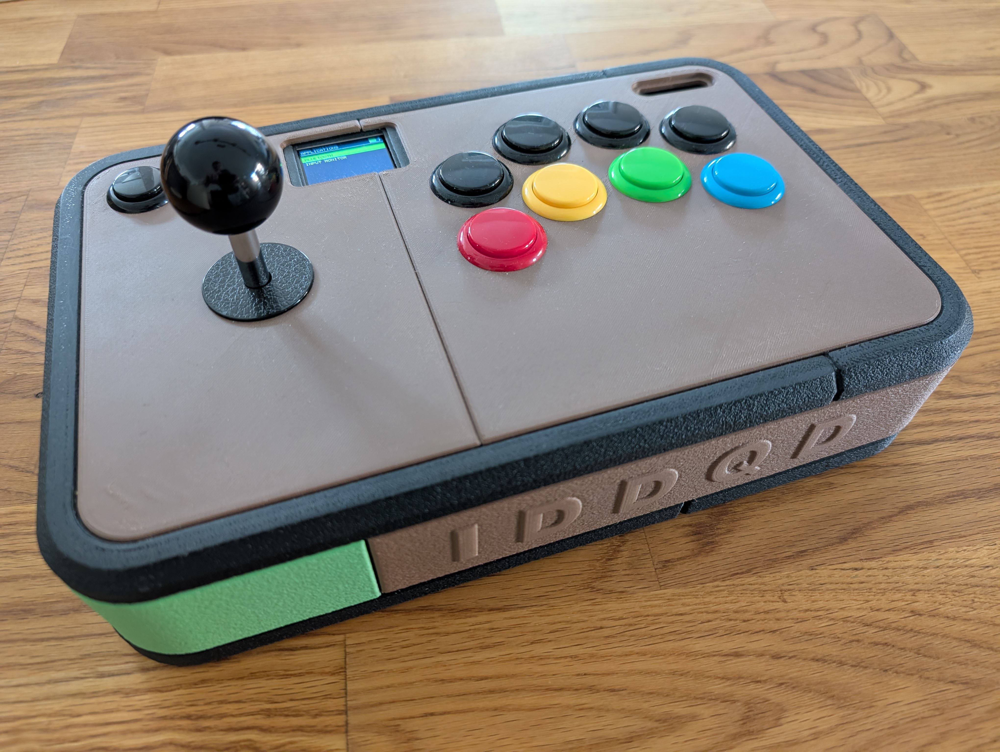
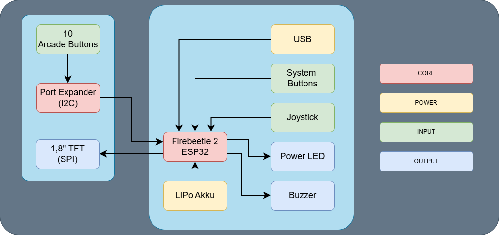
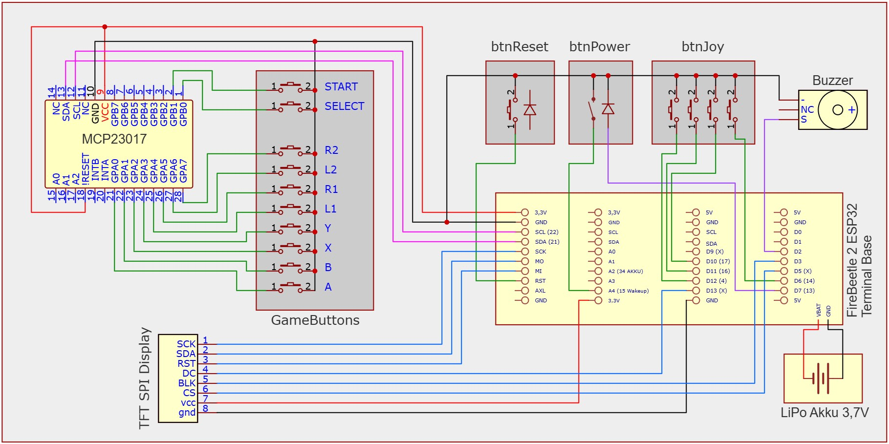
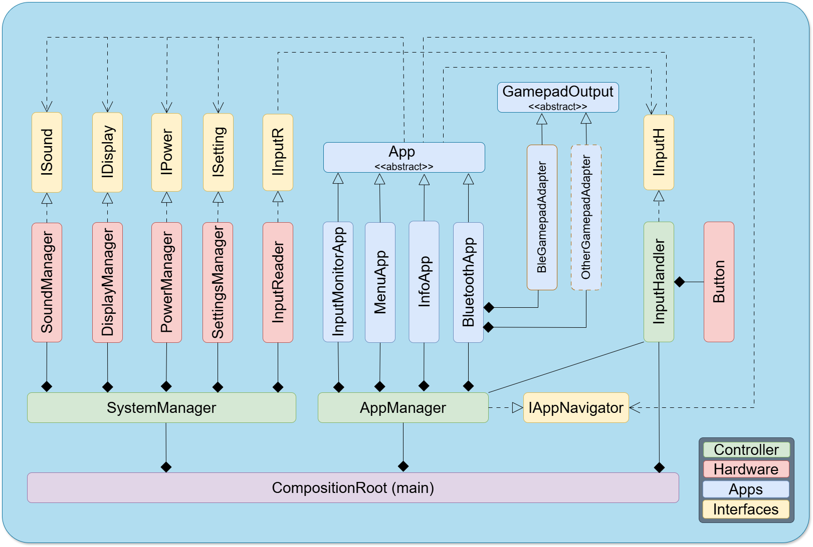

# DIY Arcade Controller Firmware (ESP32)


A modular, C++ based firmware for a custom-built Arcade Controller. Powered by an ESP32 with an MCP23017 I/O expander.



> **V1.3 — SOLID ARCHITECTURE OVERHAUL**
>
> Full application of SOLID design principles across the entire codebase. The monolithic `ArcadeController` / `ISystem` god-interface has been replaced by a proper layered architecture:
>
> `ISystem` is gone. Each HAL subsystem now exposes its own narrow interface (`IDisplay`, `ISound`, `IPower`, `ISetting`, `IInputReader`, `IInputH`). Apps declare exactly the dependencies they use — nothing more. `SystemManager` replaces `ArcadeController` as the hardware lifecycle owner; it is the only class that touches concrete HAL implementations.
>
> The input signal path has been split into two focused classes: `InputReader` (hardware boundary — GPIO, I2C, MCP23017) and `InputHandler` (software processing — debounce, bitmap, event dispatch). `InputHandler` is now constructed in `main.cpp` and injected into `AppManager` as a non-owning reference, eliminating the hidden ownership that previously lived inside `AppManager`.
>
> `IAppNavigator` replaces the concrete `AppManager*` pointer that apps previously held. All apps now depend solely on interfaces. `AppEntry` and `getRegistry()` on `IAppNavigator` enable `MenuApp` to auto-generate the applications list from the registered app catalogue — adding a new app to the menu requires a single line in `main.cpp`.
>
> **V1.2 — MAJOR REFACTORING**
>
> Project-wide cleanup and readability pass focused on the input signal path. The BLE transport, `InputHandler`, and `BluetoothApp` have been brought onto a consistent architecture: single mapping table as source of truth, explicit state machines, narrow public interfaces. Magic numbers and hex color literals were replaced project-wide with named constants (central `Colors` palette, display geometry, battery thresholds), and HAL member naming is unified. Functionally new: real edge-to-display latency measurement in `InputMonitorApp` and a targeted post-release hold-off on the joystick microswitches that suppresses pre-snap contact chatter on slow releases. Also includes dead-code removal across the public APIs and a rendering bug fix in `InfoApp`.
>
> **V1.1 — INPUT HANDLER REFINEMENT**
>
> `InputHandler` now publishes a debounced-state bitmap via `getDebouncedStates()`. Poll-style consumers such as `InputMonitorApp` read the entire input snapshot in a single register-level call instead of N individual `isPressed()` lookups. Bit positions mirror the `ControlEvent` enum, so the layout is self-documenting and shared across the project.
>
> **V1.0 — ARCHITECTURE OVERHAUL**
>
> This release decouples the App layer from the composition root via a narrow `ISystem` service interface. App lifecycle and ownership have moved from `ArcadeController` into a dedicated `AppManager`, the gamepad transport is now fully owned by the `BluetoothApp` (BLE-HID active, Switch HID profile slot reserved), and a `SpaceInvadersApp` mini-game has joined the catalogue.
>
> **PROJECT STATUS**
>
> Originally developed for a Cyber-Physical Systems module, V1.0 marks the first major release with a stable, decoupled architecture. Active development continues.

## Features

* **Eager-Press & Low-Latency Input:** The `Button` class uses eager-press debouncing — a press is registered immediately, while the release is delayed to ensure signal stability. A configurable post-release hold-off suppresses the pre-snap contact chatter observed on Sanwa-style joystick microswitches during slow releases.
* **Split Input Signal Path:** Hardware reading (`InputReader` — GPIO, I2C, MCP23017) is cleanly separated from software processing (`InputHandler` — debounce, bitmap, event dispatch). Nothing above `InputReader` touches a GPIO or I2C register directly.
* **Three-Pattern Input API:** `InputHandler` exposes the debounced input state in three complementary shapes — event callbacks for reactive consumers (`onEvent`), per-event polling for selective checks (`isPressed`, `getDuration`), and a compact 16-bit snapshot bitmap for bulk reads (`getDebouncedStates`). Each app picks the access pattern that fits its use case.
* **Narrow Interface Injection (ISP):** Every app declares exactly the subsystem interfaces it uses. `BluetoothApp` receives `IDisplay`, `IPower`, `ISetting`, and `IInputH`. `MenuApp` receives `IDisplay`, `ISound`, and `ISetting`. No app has a path to a concrete HAL class or to the rendering backend.
* **Auto-Registered App Menu:** Apps that should appear in the main menu are registered with a display label in `main.cpp`. `MenuApp` generates the applications list automatically from the registry — no manual menu items, no hardcoded strings inside `MenuApp`.
* **Multi-Mode Gamepad Transport:** `BluetoothApp` owns the gamepad adapter behind the `IGamepadOutput` interface. BLE-HID via NimBLE is the active transport; the architecture supports multiple modes switchable at runtime and persisted in flash.
* **Single HID Mapping Table:** `BleGamepadAdapter` translates every `ControlEvent` to its HID button index through one static `HID_BUTTONS` table. Adding a new arcade button is a single row.
* **Centralized Color Palette:** All UI surfaces draw against named constants in `config/Colors.h` instead of inlined RGB565 literals. Display geometry (screen size, header, progress bar, battery indicator) is encoded as named constants on `DisplayManager`.
* **Hardware Abstraction Layer (HAL):** Clean boundary between hardware logic and the application layer, enforced by interfaces. Each subsystem (`PowerManager`, `DisplayManager`, `InputReader`, `InputHandler`, `SoundManager`, `SettingsManager`) exposes a dedicated interface; apps never touch a concrete HAL class.
* **Smart Power Management:**
    * Deep sleep with wake-up via the physical power switch.
    * System reset wired to the ESP32 hardware EN-pin (no software involvement).
    * Display pin states are frozen via `gpio_hold_en()` during sleep to prevent backlight ghost-glow and battery drain.
* **Persistent System Settings:** Brightness, volume, boot mode (Normal/Stealth), and gamepad mode are stored in flash via the ESP32 Preferences library and re-applied on every boot. `SettingsManager` observes `IDisplay` and `ISound` directly — a single setter call persists the value and applies it to hardware simultaneously.
* **Pull-Based Battery Sync:** Display and gamepad consumers each pull the current battery percentage from `PowerManager` on their own cadence. Battery thresholds (full/empty/divider ratio) live as named constants on `PowerManager`.
* **Emergency Exit Combo:** Hold `SELECT + L2 + R2` for 2 seconds inside `InputMonitorApp` to return to the main menu, confirmed by a visual progress bar.

## 🛠 Hardware Setup

This firmware is designed for the following hardware configuration:

* **MCU:** ESP32 (Tested on DFRobot FireBeetle 2 ESP32-E)
* **Expander:** MCP23017 (I2C Address `0x20`)
* **Display:** SPI TFT Display, ST7735 driver, 128 × 160 px (e.g. 1.8" ST7735 GreenTab2 module)
* **Sound:** Piezo/Speaker connected to a PWM pin (Hardware LEDC Synthesis)
* **Controls:**
    * 1x Joystick (4 Microswitches)
    * 8x Arcade Action Buttons (A, B, X, Y, L1, R1, L2, R2)
    * 2x System Buttons (Select, Start)
    * 1x Power Switch (toggle, wakes from deep sleep)
    * 1x Reset Button (wired to ESP32 EN-pin)

### Block Diagram



### Wiring / Schematic



### Pinout Configuration

*See `src/config/Config.h` for exact pin mappings.*

## 🏗 Architecture



The firmware is structured in three layers. Dependencies only flow downward — the app layer never touches a concrete HAL class, and the HAL never knows about apps.

* **Composition Root (`main.cpp`):** Constructs all hardware and software objects, injects dependencies, and owns the `InputHandler`. Static allocation order ensures hardware is ready before software consumes it. All apps are registered here via `AppManager::registerApp()` — adding a new app requires a single line in `main.cpp` and zero changes to `AppManager` or `MenuApp` (Open/Closed Principle).
* **Hardware Layer (`SystemManager` + HAL):** `SystemManager` owns the four HAL singletons and drives the hardware lifecycle (`begin`, `update`, `initiateShutdown`). Each subsystem implements a dedicated interface (`IDisplay`, `ISound`, `IPower`, `ISetting`, `IInputReader`) and is exposed to the app layer only through that interface pointer.
* **Input Signal Path:** GPIO / MCP23017 → `InputReader::readRaw()` → `InputHandler` (debounce per `Button`, bitmap accumulation, edge dispatch) → `AppManager` (routes to active app via callback) → active `App`.
* **App Layer (`AppManager` + Apps):** `AppManager` holds a non-owning reference to `InputHandler`, owns the app registry, and drives the active app's lifecycle. Apps inherit from the abstract `App` base class and receive only the narrow interfaces they need via constructor injection. Navigation between apps goes through `IAppNavigator`.
* **Transport Layer:** `BluetoothApp` owns the gamepad adapter behind `IGamepadOutput`. BLE-HID via NimBLE is the active transport; a `Switch2GamepadAdapter` slot is reserved.

## 📂 Project Structure

```text
/src
 ├── main.cpp                         # Composition root — constructs and wires all objects
 ├── SystemManager.*                  # Hardware lifecycle owner, HAL interface provider
 ├── /apps
 │    ├── App.h                       # Abstract base class for all apps
 │    ├── AppId.h                     # Stable identifiers for app switching
 │    ├── AppManager.*                # App registry, lifecycle, input routing
 │    ├── /interfaces
 │    │    └── IAppNavigator.h        # Navigation interface + AppEntry registry type
 │    ├── /MenuApp                    # Main menu & settings (auto-generates app list)
 │    ├── /BluetoothApp               # Gamepad UI + transport ownership
 │    ├── /InfoApp                    # System & hardware info screen
 │    └── /InputMonitorApp            # Input visualizer & latency display
 ├── /config
 │    ├── Colors.h                    # Central RGB565 palette (named constants)
 │    └── Config.h                    # Pin mappings, ControlEvent enum, debounce config
 ├── /driver
 │    └── Button.*                    # Eager-press debounce, per-input hold-off
 ├── /hal
 │    ├── DisplayManager.*            # TFT_eSPI wrapper, UI primitives, backlight PWM
 │    ├── InputReader.*               # Hardware boundary — GPIO + MCP23017 polling
 │    ├── InputHandler.*              # Software processing — debounce, bitmap, events
 │    ├── PowerManager.*              # ADC battery measurement, deep sleep, gpio_hold
 │    ├── SettingsManager.*           # Persistent flash storage (ESP32 Preferences)
 │    ├── SoundManager.*              # Non-blocking LEDC PWM sound synthesis
 │    └── /interfaces
 │         ├── IDisplay.h             # Display contract (drawing primitives + state)
 │         ├── IInputH.h              # InputHandler read-only query contract
 │         ├── IInputReader.h         # Raw hardware bitmap contract
 │         ├── IPower.h               # Battery state contract
 │         ├── ISetting.h             # Persistent settings contract
 │         └── ISound.h               # Audio contract + SoundEffect enum
 └── /transport
      ├── GamepadOutput.*             # Abstract gamepad output base
      ├── IGamepadOutput.h            # Gamepad transport interface
      └── BLEGamepadAdapter.*         # NimBLE BLE-HID implementation
```

## ⚠ Known Issues

* **BLE-HID battery level reporting:** The controller calls `setBatteryLevel()` on every battery-percentage change, but some hosts do not display the value correctly. The root cause is suspected in the HID battery-service initialization order rather than the firmware logic; investigation is ongoing.
